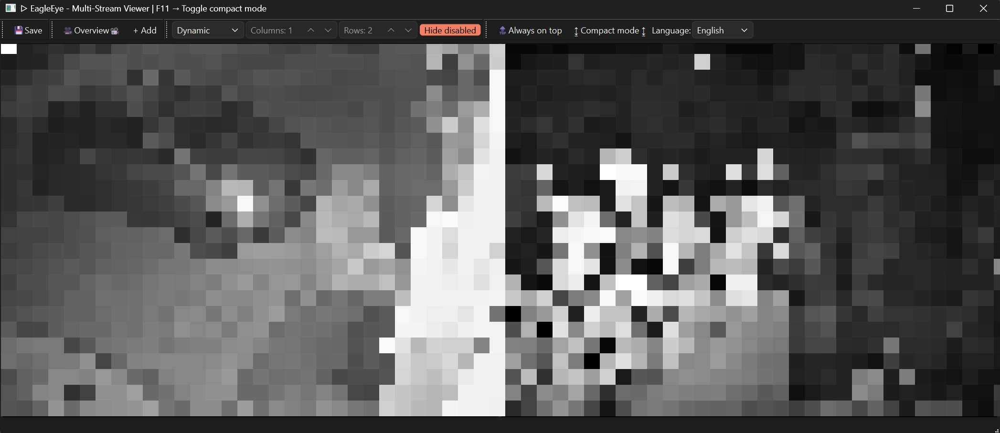

# EagleEye

**Lightweight Multi-Camera Stream Viewer**

EagleEye is a cross-platform desktop application for monitoring multiple IP cameras simultaneously. Built with Python and PyQt6, it combines professional surveillance features with a clean, intuitive interface.



---

## Features

### Multi-Stream Support
- RTSP (TCP/UDP/Multicast)
- MJPEG (multipart/x-mixed-replace)
- HTTP Video (H.264/H.265)
- Snapshot JPEG (polling)
- Automatic stream type detection

### Professional Monitoring
- Live Grid Layout – Dynamic or fixed tile arrangement
- Drag & Drop Reordering – Arrange cameras as needed
- Fullscreen Mode – Double-click any tile for full view
- Digital Zoom – Ctrl+Mouse wheel (up to 6x)
- FPS Display – Per-stream performance monitoring

### Recording
- Record any stream to MP4 (H.264)
- Individual recording per camera
- REC indicator on active recordings
- Automatic file naming with timestamps

### Audio Support
- Real-time audio playback
- Automatic audio track detection
- Only one stream plays audio at a time (prevents mixing)

### Performance Optimizations
- One thread per stream – No GIL bottleneck
- Latest-frame-only buffer – Minimal latency, constant memory usage
- GPU acceleration – NVDEC, VideoToolbox, VAAPI support
- Per-stream FPS capping – Save CPU with lower frame rates

### Advanced Controls
- Enable/disable streams individually
- Main/Sub-stream switching
- Hardware decoding support
- Per-stream rotation (0, 90, 180, 270 degrees)
- Decode scaling (0.1 - 1.0)
- Configurable reconnect delay
- Error muting for flaky cameras

### User Interface
- Dynamic grid layout adapts to window size
- Fixed grid layout with custom columns/rows
- Hide disabled streams
- Compact mode (F11) – toolbars and status bar hidden
- Always on top mode
- Multi-language support (English, German)
- Camera overview table with quick actions
- Reorder tiles via drag & drop
- Selection highlighting

### Persistence
- Auto-save stream configurations
- Restore window position and size
- Remember compact mode state
- Save toolbar layout

---

## Supported Stream Types

| Type | Description |
|------|-------------|
| `snapshot_jpeg` | Single JPEG image, polled at interval |
| `mjpeg` | Server-push multipart/x-mixed-replace |
| `http_video` | Progressive H.264/H.265 over HTTP (via FFmpeg/PyAV) |
| `rtsp_tcp` | RTSP over TCP (H.264/H.265) |
| `rtsp_udp` | RTSP over UDP Unicast (H.264/H.265) |
| `rtsp_multicast` | RTSP over UDP Multicast (H.264/H.265) |
| `auto` | Automatic detection via HTTP headers / URL heuristics |

---

## Architecture

```
EagleEye/
├── main.py                     # Application entry point
├── requirements.txt
└── EagleEye/                   # Core package
    ├── stream_types.py         # Stream type enumeration
    ├── stream_config.py        # Stream configuration dataclass
    ├── frame_buffer.py         # Thread-safe latest-frame buffer
    ├── detector.py             # Automatic stream type detection
    ├── stream_worker.py        # Decoding thread (all stream types)
    ├── recorder.py             # MP4 recording functionality
    ├── video_widget.py         # Per-stream display widget
    ├── settings_dialog.py      # Stream settings dialog
    ├── camera_manager_dialog.py# Camera overview table
    ├── main_window.py          # Main window, grid layout, persistence
    └── i18n.py                 # Internationalization support (En/De)
```

---

## Installation

### Requirements
- Python 3.8 or higher
- PyQt6
- av (PyAV) – includes FFmpeg
- OpenCV (headless)
- numpy
- requests

### Quick Start

```bash
# Clone the repository
git clone https://github.com/yourusername/eagleeye.git
cd eagleeye

# Install dependencies
pip install -r requirements.txt

# Optional: Install audio support
pip install sounddevice

# Run the application
python main.py
```

---

# License

This project is licensed under a custom non-commercial license - see [LICENSE](LICENSE). Non-commercial use, copying, and modification are permitted; commercial use requires prior written permission from the author.

**Disclaimer:** This software is provided "as is". No liability is accepted for data loss, or security incidents. Use at your own risk.